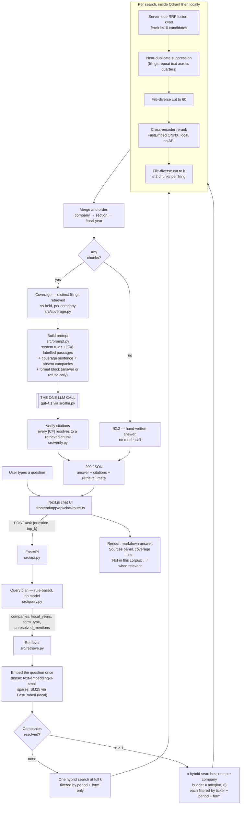
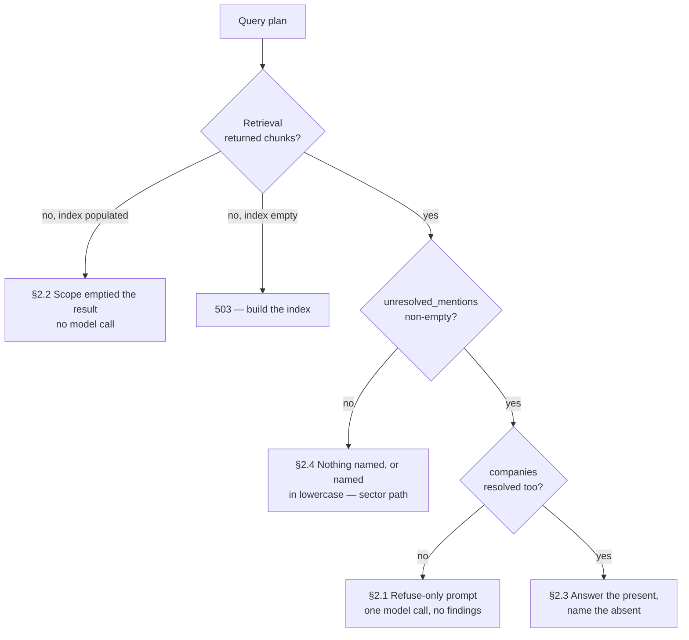

# Architecture — what happens when a question is asked

The flow from a typed question to a rendered answer, and every branch the system takes when
the corpus does not hold what was asked for. Line references are to the code as of 2026-10-01;
the README's "How a question is answered" section is the short version of §1, and
`docs/PROMPT_TEMPLATE.md` holds the prompt text this document only summarises.

Two invariants shape every branch below:

- **Exactly one LLM call produces an answer, and some branches make zero.** Everything before
  the call — entity resolution, time scope, retrieval, fusion, reranking, coverage — is
  deterministic. An interviewer can verify this by counting `complete()` call sites (SPEC §5.2).
- **The system never substitutes.** A company, period or form the corpus lacks is reported as
  missing, by name, rather than answered from the nearest available filing or from the model's
  own knowledge. Every refusal path below exists because a measurement showed the substitution
  happening.

## 1. The happy path



### 1.1 The frontend does almost nothing, on purpose

`frontend/app/api/chat/route.ts` takes the latest user turn, persists it to SQLite for the
sidebar, and forwards the question alone to `POST /ask`. Prior turns are not sent: follow-ups
are a stated non-goal, and the backend owns all generation. The frontend has no LLM provider
dependency at all, so the one-call constraint is structural rather than conventional. The
answer arrives as one JSON burst because `/ask` returns a finished answer, not a token stream.

### 1.2 Query planning — `src/query.py`

Three facts are read off the question text with regexes and a dictionary, and nothing else:

| Fact | How | Example |
|---|---|---|
| `companies` | Longest span of words that matches the alias table, scanned from every word, case-insensitive. The alias table is built at startup from the `Company:`/`Ticker:` header lines of the 246 filings, plus distinctive name words and a few colloquial names ("Amex", "Coke"). Capitalised spans also get a strict fuzzy match for typos. | "what did apple say" → `AAPL`; "JP Morgen" → `JPM` |
| `unresolved_mentions` | A run of **capitalised** words that resolved to nothing and is not filing vocabulary ("Risk", "Item", "China") or a bare descriptor ("Bank", "Technologies"). | "Shopify's China exposure" → `["Shopify"]` |
| `fiscal_years` | Explicit years, `since YYYY`, or "last N years" anchored to the corpus's newest fiscal year rather than today's date. | "last two years" → `(2024, 2025)` |
| `form_type` | "quarterly"/"10-Q" vs "annual"/"10-K". Both or neither means no filter. | "10K for 2025" → `10-K` |

Seven aliases that are also ordinary words only resolve when capitalised or written as the
ticker: cost, target, cat, ups, chase, gamble, visa. "apple's cost structure" is Apple alone,
not Apple plus Costco.

### 1.3 Retrieval — `src/retrieve.py`

**Entity quotas are the most important behaviour in the system.** A global top-k on "compare
Apple, Tesla and JPMorgan" returns whichever company writes the most vivid risk factors. With
quotas, each named company gets its own filtered hybrid search with budget `k/n` (floor 6), so
every company asked about is represented. The question is embedded once and reused across the
quota searches. The merge is ordered company → section → year, because a comparison grouped by
company is readable and one interleaved by score is not.

Each search is fetch-deep, bound, rerank, spread. Qdrant fuses the dense and sparse rank lists
server-side with Reciprocal Rank Fusion over a pool ten times the final limit, near-duplicates
are suppressed, a file-diverse 60 go to a local cross-encoder, and the final k slots are spread
across filings at most two per filing. None of this is an LLM call.

### 1.4 Coverage — `src/coverage.py`

Before the prompt is built, the system counts **distinct filings retrieved vs held** per
company. "JNJ 3 of 17 filings, MRK 1 of 1" tells a reader that an industry-level answer is
standing on two companies, and distinguishes a limit of the data (`1 of 1`) from a limit of
the budget (`3 of 17`). The sentence is passed to the model as a fact to hedge against and
returned in `retrieval_meta` so the UI renders a copy the model cannot garble.

### 1.5 The one call and what follows it — `src/prompt.py`, `src/api.py`, `src/verify.py`

The system message carries six grounding rules. The ones that matter for this document: answer
only from the passages (rule 1), every claim carries a `[C#]` handle (rule 2), a named company
with no passages is reported absent by name while the present ones are still answered (rule
3), never name a company, ticker or figure not in the context (rule 5).

The user message is the labelled passages, the companies present, the question, and **last**
the format block: Bottom line → Findings → Comparison → Gaps and confidence → Sources. It is
placed last because measurement showed instructions before 14k tokens of passages were not
reliably followed.

After the call, `verify_citations` checks every handle in the answer against the retrieved
set. Fabricated handles are listed in `retrieval_meta.citation_check`, never silently removed.

## 2. When the corpus does not have it

Four distinct situations, decided by the query plan and the retrieval result, not by the model.
The decision is made in `src/api.py` and `src/prompt.py`:



### 2.1 A named company the corpus does not hold — "give me Colgate 10K for 2025"

The planner finds "Colgate" capitalised, fails to resolve it, and records it as an unresolved
mention. No company resolved, so retrieval runs one unfiltered search scoped to FY2025 10-Ks
and returns ~20 passages from other companies. The API sees `absent=["Colgate"]` and
`named_present=[]` and selects the **refuse-only** user message: it tells the model the
passages are about other companies, forbids Findings, Comparison and any citation, and asks for
only a Bottom line stating there are no Colgate filings and a Gaps section. The one call is
still made. The response is a 200 with `entities_detected: []` and
`unresolved_mentions: ["Colgate"]`, and the Sources panel shows "Not in this corpus: Colgate".

This path exists because without the instruction the model refused correctly and then wrote
findings for Amazon, Bank of America and eight others. Rule 3 alone was not enough; the model
is told the fact rather than left to infer the absence.

### 2.2 A company the corpus holds, for a period or form it does not — "Apple's 10-K for 2010"

Apple resolves, the year filter is honoured literally, and the filtered search returns zero
chunks. With a populated index this is **answered in code with no model call**: with zero
passages a generated answer could only come from the model's own knowledge of Apple, which rule
1 forbids. `no_matches_answer` names the scope that emptied the result ("AAPL, fiscal year
2010, 10-K filings only") and the fiscal years the corpus actually covers, and says it will not
answer from a different period than the one asked about. `retrieval_meta` carries
`no_matches: true`, `n_chunks: 0`, and omits `generation_model` because nothing generated it.

The same path fires for any over-narrowed scope. It replaced a `503 the index may be empty`
error that used to send the reader after a problem they did not have.

### 2.3 A mix of present and absent — "Compare Apple and Colgate on tariffs"

Apple resolves and gets a full quota; Colgate is unresolved. The normal five-part format block
is used, with a note appended that the question mentions Colgate, the corpus holds no filings
for it, and the model must say so explicitly while still answering fully for Apple. The
coverage block also lists Colgate under `named_but_absent`.

### 2.4 Nothing the planner can act on — the sector path, and its known gap

A question that names no company ("what regulatory risks do pharmaceutical companies face") is
a sector question, not a refusal. It runs unfiltered and is answered over whatever was retrieved,
with the coverage sentence doing the honesty work ("standing on JNJ and PFE; ABBV, MRK, LLY and
TMO each hold one filing").

**The known gap:** a company the corpus lacks, written in lowercase, is indistinguishable from
any other word. "give me colgate 10k for 2025" produces no unresolved mention, so it takes this
sector path and the only guards are rules 1, 3 and 5 of the system prompt. The planner's
capitalisation heuristic is the one deterministic signal for an unknown proper noun; fixing this
would need a word list the system does not carry. Known companies in lowercase are unaffected
and resolve normally.

### 2.5 Summary

| Situation | Model called? | What the reader sees | Where decided |
|---|---|---|---|
| Named company absent, nothing else named | Yes, refuse-only prompt | Bottom line + Gaps, no findings, no citations | `prompt.user_prompt` |
| Company present, period/form empties retrieval | **No** | Hand-written answer naming the scope and the years held | `api._no_matches` |
| Some named present, some absent | Yes, normal format + note | Full answer for the present, explicit "not in corpus" for the absent | `prompt.user_prompt` |
| No company detected | Yes, normal format | Sector answer with coverage sentence | default |
| Index empty or unreachable | No | 503 with a build instruction | `api.ask` |

## 3. What is returned, and why the UI shows it

```json
{
  "answer": "...",
  "citations": [{"id": "C1", "company": "...", "form_type": "10-K", "fiscal_year": 2024,
                 "section": "Item 1A Risk Factors", "source_file": "...", "excerpt": "..."}],
  "retrieval_meta": {
    "entities_detected": ["AAPL"],
    "unresolved_mentions": [],
    "fiscal_years": [2024, 2025],
    "form_type": "10-K",
    "n_chunks": 20,
    "coverage": {"companies": [...], "thin": [...], "named_but_absent": [...], "sentence": "..."},
    "citation_check": {"cited": ["C1", "C4"], "fabricated": [], "n_cited": 2, "n_available": 20, "verified": true},
    "prompt_version": "v8",
    "retrieval": "hybrid dense+sparse, server-side RRF + cross-encoder rerank (...)",
    "generation_model": "gpt-4.1",
    "latency_ms": {"retrieval": 1830.2, "generation": 6210.5, "total": 8040.7}
  }
}
```

`retrieval_meta` is SPEC §8's requirement that the UI show which chunks drove the answer. It is
also how every refusal above is auditable from the screen: an empty `entities_detected` with a
populated `unresolved_mentions` is a §2.1 refusal, `no_matches: true` is §2.2, and a missing
`generation_model` proves no model was called.
