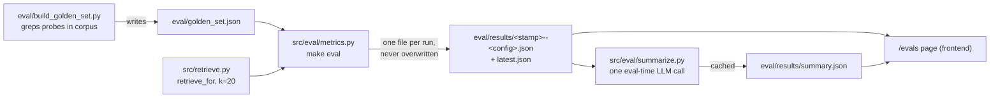

# Eval walkthrough — how the harness works, for engineers

This is the mechanics document: what runs when you type `make eval`, where ground truth
comes from, what guards the answer side, and where the harness is weakest. Its companion,
[`EVALUATION.md`](EVALUATION.md), is the *interpretation* document — why the numbers read
the way they do, which metrics are saturated, and what was measured before being set aside.
Read this one to change the harness; read that one before quoting a number from it.

---

## 1. The moving parts

| piece | file | what it does |
|---|---|---|
| Golden set (data) | `eval/golden_set.json` | 25 questions with corpus-derived labels |
| Golden set (builder) | `eval/build_golden_set.py` | Regenerates the labels from the filings — never from retrieval |
| Loader | `src/eval/golden.py` | `GoldenQuestion` dataclass + `load()`, shared by every consumer |
| Retrieval metrics | `src/eval/metrics.py` | Scores retrieval per question, writes `eval/results/` |
| Generated summary | `src/eval/summarize.py` | One eval-time LLM call → `eval/results/summary.json` for the `/evals` page |
| Answer-contract gate | `tests/` (`-m live` tier) | 32 live tests; 11 make real generation calls |
| Label integrity | `tests/test_golden_set.py` | Re-derives every label from the corpus at test time |
| Answer verifier | `src/verify.py` | Deterministic per-request checks (citations resolve, no foreign tickers, figures traced) |

Two independent tracks, deliberately:

- **Retrieval eval** (`make eval`) — offline, scores the retriever against labels, produces
  the numbers. Costs embedding calls only (the questions get embedded); no generation.
- **Answer eval** (`make test-live`) — pass/fail, exercises the full `/ask` path against a
  real model. This is the gate; the retrieval numbers are the instrument panel.

There is no scored per-run answer eval (LLM-as-judge). SPEC §10 lists it as the first thing
to cut under the timebox, and it was cut. See §7 below.

---

## 2. The flow, end to end



`make eval` runs `src.eval.metrics` then `src.eval.summarize`. The metrics step:

1. Loads all 25 questions, drops the 3 `unanswerable` ones (they have no relevant filings,
   so recall over them is undefined — they are tested on the *answer* side instead, §5).
2. For each of the 22, calls the real retriever — `retrieve_for(question, k=20)` — which is
   the same code path `/ask` uses: query planning, per-company quotas, RRF fusion,
   near-duplicate suppression, optional rerank. **The eval therefore scores
   post-suppression retrieval**, which is the source of the label/suppression conflict
   documented in `EVALUATION.md` §3.
3. Scores at **file level**: a retrieved chunk contributes its `source_file`, so twenty
   chunks from one filing count as one filing of coverage.
4. Writes a timestamped results file plus `latest.json`. Runs are never overwritten —
   every table in `EVALUATION.md` is a before/after between result files.

The config label in each file (`hybrid+quotas+prefix[+rerank]`) is derived from what
actually ran, so two result files can't be confused for each other. The only switch is
`RAG_RERANK=0`.

---

## 3. Ground truth: how a label is made, and how to add a question

Questions are hand-written; **labels are computed**. Each answerable question carries a
`probe` term (e.g. `"CHIPS Act"`, `"Autopilot"`), and its `source_files` are exactly the
filings that contain that probe, restricted to the tickers the question names. The builder
never calls retrieval — a golden set labelled from retrieval output would make every metric
a measure of how closely a configuration reproduces today's behaviour.

Probes are chosen **narrow**. `"CHIPS Act"` appears in one filing; `"pandemic"` appears in
186 and would label half the corpus relevant, measuring nothing.

Fields worth knowing when you walk someone through a question entry:

- `tickers` — empty for sector and unanswerable questions; drives `entity_coverage`.
- `expect_fiscal_years` — **hand-written**, deliberately not derived from `src/query.py`.
  A label built by our own parser would agree with a parser bug. The harness instead
  reports `parser_window_agrees` per temporal question, turning the coupling into an
  observation.
- `absent` — companies the corpus does not hold; the refusal cases.
- `note` — why these labels are right, for an auditor.

**To add a question:** add a `dict(...)` to `QUESTIONS` in `eval/build_golden_set.py`
(pick a narrow probe, check its file count first), run the builder, commit the regenerated
JSON. `tests/test_golden_set.py` re-derives every label from the corpus at test time, so a
label that can't be reproduced from the filings fails rather than lingering — and the
category counts are pinned to SPEC §7.1's shape, so changing the mix is a deliberate edit.

```bash
uv run python eval/build_golden_set.py
uv run pytest tests/test_golden_set.py -q
```

---

## 4. Scoring: what each number is

Computed per question in `src/eval/metrics.py`, then averaged overall and by category:

| metric | at | one-line meaning | trust level (see EVALUATION.md) |
|---|---|---|---|
| `recall@k` | 5, 10, 20 | labelled filings found / labelled filings | misleading raw — per-question ceilings vary 36× |
| `normalized_recall@k` | 5, 10, 20 | found / `min(k, \|R\|)` — recall against what was *attainable* | the honest recall figure |
| `mrr@10` | 10 | 1/rank of the first relevant filing | saturated (~0.98) — measures the entity filter |
| `ndcg@10` | 10 | rank-discounted gain vs ideal ordering | saturated (~0.92), same reason |
| `entity_coverage@k` | 10, **20** | named companies present in the retrieved set | the one that moves; pinned at 1.0 by quotas at k=20 |

Mechanics that matter when reading a results file:

- **Coverage is reported at the retrieval budget (20), not just 10**, because results are
  ordered company → section → date, so on a three-company question the third company sits
  at ranks 13–18. `@10` reflects the ordering, not retrieval; the model sees all 20.
- **`entity_coverage` is `None`, not 0, when a question names nobody** — sector questions
  are excluded from the average rather than dragging it down meaninglessly.
- **A zero `recall@10` is never published bare.** The `suspect` field distinguishes "the
  label spans 32 filings and only ~15 distinct files can fit at k=10" from "retrieval
  actually missed", and the CLI prints every suspect.
- **The `note` field in every results file carries the caveats.** A caveat only a reader of
  the module sees is a caveat the results don't carry.

---

## 5. The answer side: a gate, not a dashboard

Answer quality is defended by pass/fail tests, split into tiers (`Makefile`,
`tests/conftest.py`):

```bash
make test        # 257 python + 54 frontend — no key, no Docker, no cost
make test-live   # 32 live tests, 11 real generation calls — spends money, opt in
```

The live gate covers: the three demo questions end to end (five-part answer, resolvable
citations); the out-of-corpus refusal (*names* the missing company, produces no findings
for anyone else); no fabricated attribution (no ticker in the answer whose company wasn't
retrieved, checked against the full alias table); **exactly one generation call**, asserted
by a counting stub even on the three-company question; and structural stability across
repeated generations — one compliant sample is luck, not a property.

Refusal is checked **on the answer, not on the alias lookup** — "the alias resolved to
nothing" says nothing about what the model then wrote.

Deterministic checks also run on **every production request**, in `src/verify.py`: every
`[C#]` resolves to a real chunk, no unretrieved ticker appears, numeric strings trace to
context. The eval-time equivalent (`verify_figures` in `summarize.py`) applies the same
rule to the generated summary.

Three tests in `tests/test_ask.py` keep the one-call constraint structural: provider call
sites are counted per tier, the answer path is proved not to import `src/eval/` at all, and
every sanctioned eval-time call site is named in a list, so a new one is a deliberate edit.

---

## 6. The generated summary and the `/evals` page

`src/eval/summarize.py` makes the **one sanctioned eval-time LLM call**, producing the
plain-English summary the `/evals` page leads with. Key mechanics:

- Cached to `eval/results/summary.json`; cache key is `(PROMPT_VERSION, model, run
  filenames)`. Viewing the page spends nothing; a new run makes the page say the summary is
  stale rather than silently describing old data. `--check` verifies freshness for free.
- Output is structured `{headline, findings, caveat}`, each finding `{point, metrics}` —
  the sentence plus the metric keys it rests on, so plain language stays traceable.
- `verify_figures` flags (never strips): figures absent from run data, points quoting a
  figure without naming a metric, and metric keys that don't exist.
- Its prompt is versioned in `PROMPT_LOG.md` under `## Eval-summary prompt vN` — bump
  `PROMPT_VERSION` on any prompt change or the cache serves text the current prompt would
  never produce.

The two failure modes the figure check *cannot* catch — a real figure attributed to the
wrong configuration, and a metric explained wrongly in words — are documented in
`EVALUATION.md` and are why the hand-written metric notes stay on the page. Don't tidy them
into the generated summary.

---

## 7. Where this harness is weak — improvement list

Ordered roughly by value. Items 1–5 restate `EVALUATION.md` §5 (the measurement-quality
gaps); 6–10 are harness-mechanics gaps that document doesn't cover.

1. **n=22 is too small.** Grow to 40–60 questions, weighted toward comparative and
   temporal. File-level labelling via probes is what makes this cheap — an afternoon, not a
   labelling project.
2. **Section-level relevance**, so metrics discriminate *within* a company's filings
   instead of measuring the entity filter. The `sections` field already exists on every
   question; nothing scores against it yet.
3. **Score retrieval pre-suppression** and measure suppression separately as a
   context-redundancy metric. Today every correctly-suppressed duplicate lowers recall
   while improving the answer.
4. **Domain metrics**: item-section precision, and temporal-scope correctness with a
   baseline-present flag (an answer built from 10-Qs alone presents amendments as a
   complete risk profile — invisible to every current metric).
5. **Paired significance test per question**, so ablation tables become evidence rather
   than decoration.
6. **The ablation is two rows, not five.** SPEC §7.3 asks for BM25-only → dense-only →
   hybrid → +quotas → +prefix; the harness's only switch is `RAG_RERANK`. The other axes
   would need flags in `src/retrieve.py` (single-vector prefetch, quota bypass) and a
   re-index without the prefix. Cheap to add for fusion/quotas; the prefix row costs a
   second index (~$0.40, ~15 min).
7. **No regression gate.** `make eval` is manual and nothing compares a run against a
   committed baseline — a retrieval regression is only caught by a human reading the
   numbers. A `--against <results-file>` mode that exits non-zero on a per-question
   normalized-recall drop beyond a threshold would make eval runnable in CI (needs Qdrant +
   an embedding key there, so likely a nightly job rather than per-PR).
8. **Latency isn't recorded in results files.** The API measures `latency_ms` per stage but
   the eval harness discards it; the rerank cost claim (328 ms) lives only in prose.
   Capturing per-question retrieval latency is a few lines in `metrics.run()`.
9. **Scored answer eval (LLM-as-judge)** on groundedness / citation precision /
   completeness / refusal correctness — the deliberate SPEC §10 cut. If added: judge calls
   are eval-tier, so they must be registered in `test_ask.py`'s sanctioned-call-site list,
   and judged against the golden set's `note` fields rather than free-form.
10. **Unanswerable questions are invisible to `make eval`.** They're excluded from
    retrieval metrics (correctly) and covered only by the live gate, so a refusal
    regression costs a paid test run to notice. A cheap middle tier — assert retrieval
    returns nothing for the absent ticker — would catch the retrieval half for free.

---

## Appendix — commands

```bash
make eval                      # metrics over 22 questions (~2 min) + page summary
RAG_RERANK=0 make eval         # the fusion-only configuration row
make eval-summary              # regenerate the page summary if stale
uv run python -m src.eval.summarize --check   # staleness check, spends nothing
uv run python eval/build_golden_set.py        # re-derive labels from the corpus
uv run pytest tests/test_golden_set.py -q     # prove every label reproduces
make test-live                 # the answer-contract gate (spends money)
```
